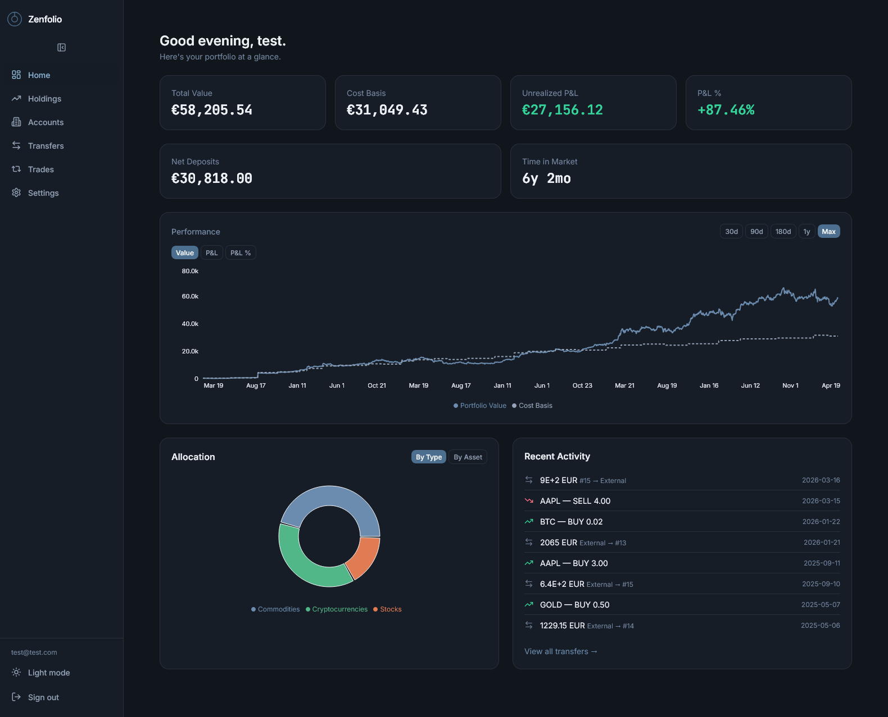
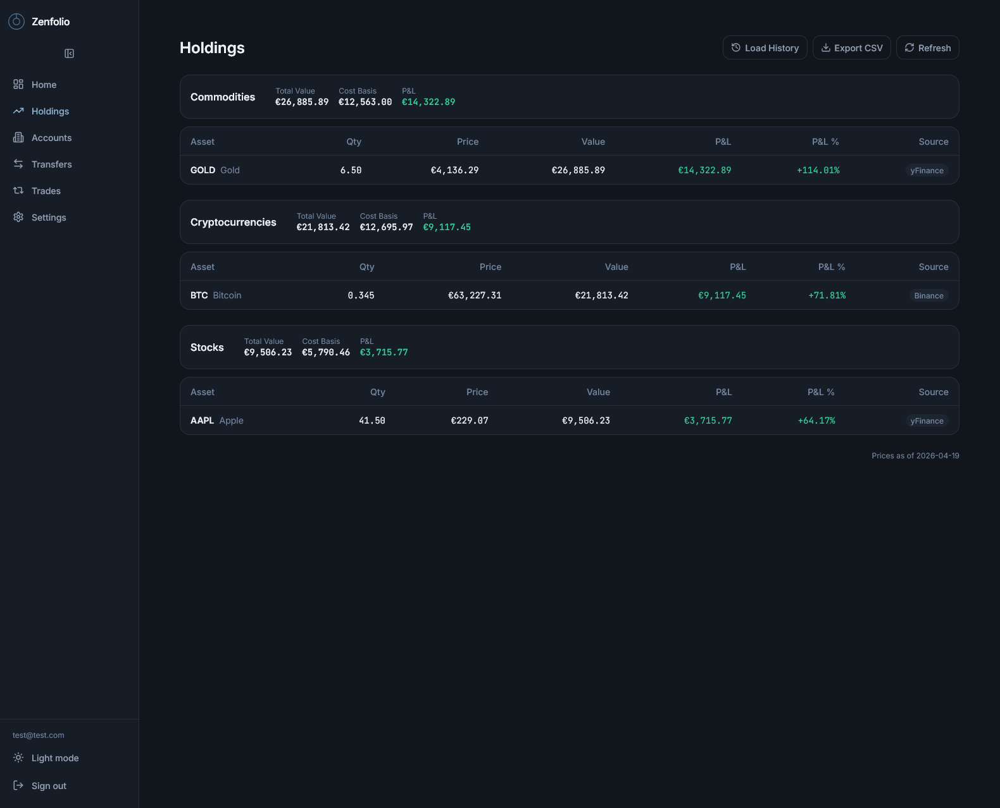
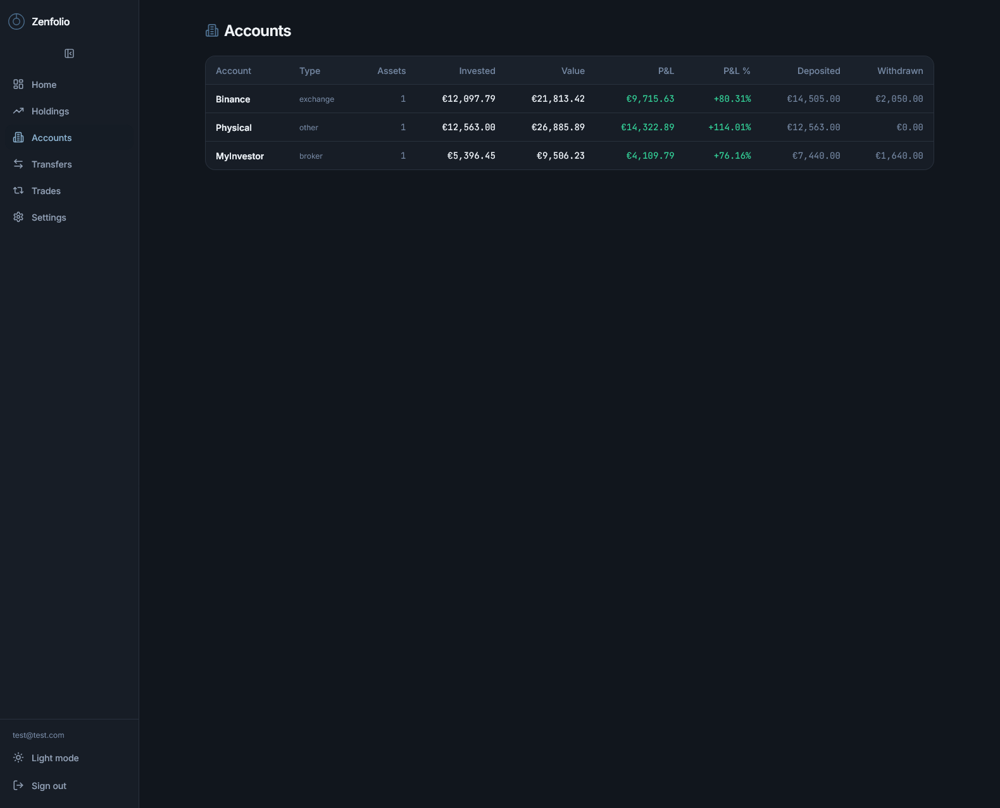
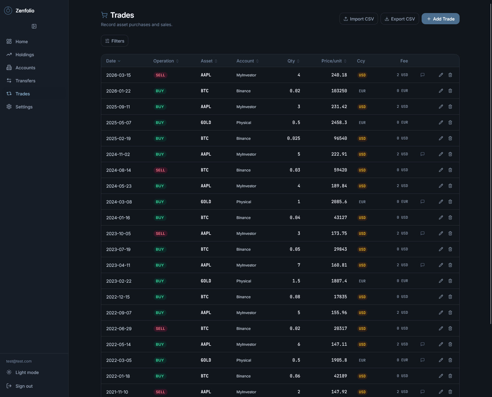
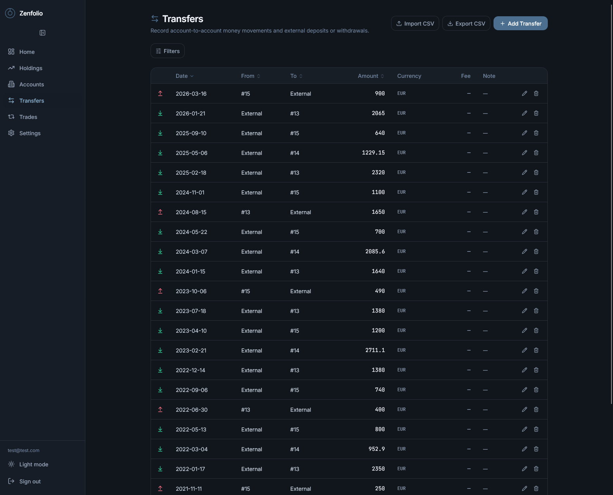

<div align="center">

# CashFolio

**A self-hosted portfolio tracker for people who invest in everything.**

Track stocks, crypto, commodities, and more — across multiple accounts —  
from your own server, with your own data.

[](LICENSE)
[](https://python.org)
[](https://fastapi.tiangolo.com)
[](https://react.dev)
[](https://docker.com)



</div>

---

## What is CashFolio?

CashFolio is a **self-hosted, multi-user** investment portfolio tracker built for people who hold assets across different brokers, exchanges, and account types. You feed it two things — **trades** and **transfers** — and it figures out everything else: cost basis, unrealized P&L, allocation, portfolio history.

No subscriptions. No third-party data sharing. Just your numbers, on your server.

---

## Screenshots

<table>
  <tr>
    <td></td>
    <td></td>
  </tr>
  <tr>
    <td></td>
    <td></td>
  </tr>
</table>

---

## Features

**Portfolio**
- Holdings computed with **average cost basis** — cross-account, always up to date
- Portfolio **history chart** — value, cost basis, and P&L over any time window
- **Allocation breakdown** by asset type or individual asset (donut chart)
- Per-account **P&L summary** — invested, current value, gain/loss

**Data entry**
- Log **trades** (BUY / SELL) and **transfers** (deposits / withdrawals)
- **CSV import and export** for both trades and transfers
- Manual **custom price entries** for assets without a price source

**Prices — fully free, no API keys required**
- Crypto prices via **Binance** public API
- Stock and ETF prices via **yfinance**
- FX rates via **Frankfurter** (ECB data)
- Automatic **nightly price refresh** (00:05 UTC) + manual trigger

**Platform**
- **Multi-user** with JWT authentication and refresh tokens
- **Firefly III** integration — sync external account balances for net worth view
- **Dark mode** with system-aware toggle
- **Mobile-friendly** — card layout on small screens, full table on desktop
- Fully **Docker-based** — one command to run, no host dependencies

---

## Quick Start

```bash
git clone https://github.com/AndresRzCh/cashfolio.git
cd cashfolio

cp .env.example .env
# Open .env and set a strong SECRET_KEY:
#   openssl rand -hex 32

docker compose up -d
```

Open **http://localhost:7410** and register your first account.

> The app will refuse to start if `SECRET_KEY` is not set — this is intentional.

---

## Configuration

All options are in `.env.example`. The only required change before running:

| Variable | Required | Description |
|---|---|---|
| `SECRET_KEY` | **Yes** | 64-char hex string for signing JWT tokens — `openssl rand -hex 32` |
| `DATABASE_URL` | No | SQLite path inside the container. Default: `sqlite:////data/cashfolio.db` |
| `ACCESS_TOKEN_EXPIRE_MINUTES` | No | Access token lifetime (default: 30) |
| `REFRESH_TOKEN_EXPIRE_DAYS` | No | Refresh token lifetime (default: 30) |
| `CORS_ORIGINS` | No | Comma-separated allowed origins. Add your domain in production |

---

## Data & Backup

The SQLite database is stored on the host at `./data/cashfolio.db` — no named volumes, no mystery.

```bash
# Back it up any time:
cp data/cashfolio.db cashfolio-$(date +%Y%m%d).db
```

---

## Tech Stack

| Layer | Technologies |
|---|---|
| **Backend** | Python 3.12, FastAPI, SQLModel, Alembic, APScheduler, SQLite |
| **Frontend** | React 18, TypeScript, Vite, TailwindCSS, Recharts, TanStack Query & Table |
| **Auth** | JWT (python-jose) + bcrypt, access + refresh token flow |
| **Infra** | Docker multi-stage builds, nginx reverse proxy |

---

## Project Structure

```
cashfolio/
├── backend/
│   ├── app/
│   │   ├── api/v1/        # FastAPI routers (one file per resource)
│   │   ├── core/          # Config, DB engine, auth dependency
│   │   ├── models/        # SQLModel table definitions
│   │   ├── schemas/       # Pydantic request/response schemas
│   │   └── services/      # Business logic, price fetching, CSV import
│   └── alembic/           # Database migrations
└── frontend/
    └── src/
        ├── features/      # One folder per page/feature
        ├── components/    # Shared layout components
        └── lib/           # Axios instance, currency formatter
```

---

## Disclaimer

> **This project was entirely vibe-coded with [Claude Code](https://claude.ai/code).**  
> No design documents, no architecture meetings, no sprints — just a person, an AI, and a vision of a portfolio tracking app. The code is clean, tested, and production-hardened, but this is a personal project. Use it at your own risk, and don't make financial decisions based on its output.

---

## License

[MIT](LICENSE)
